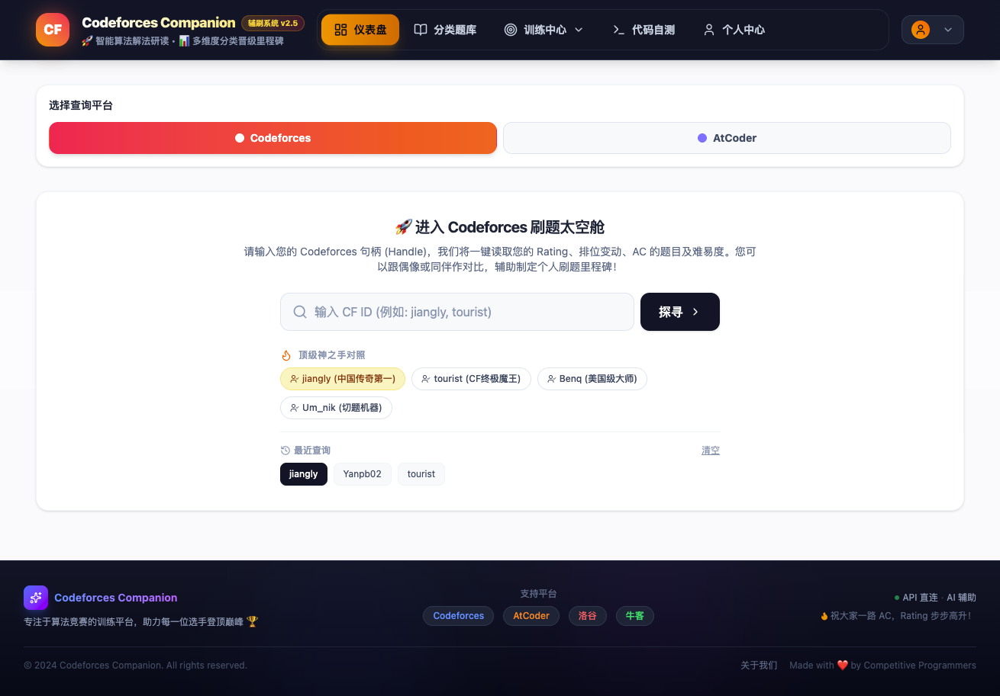
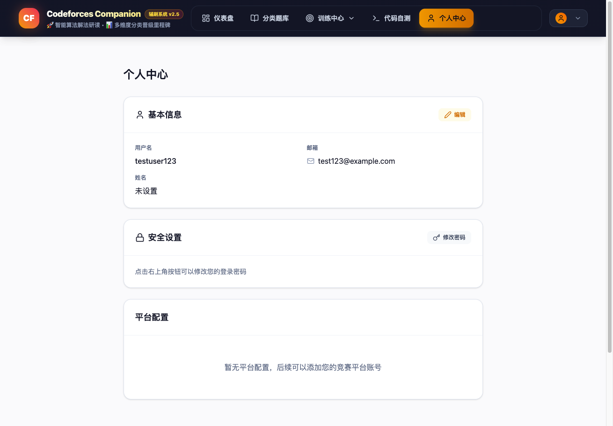
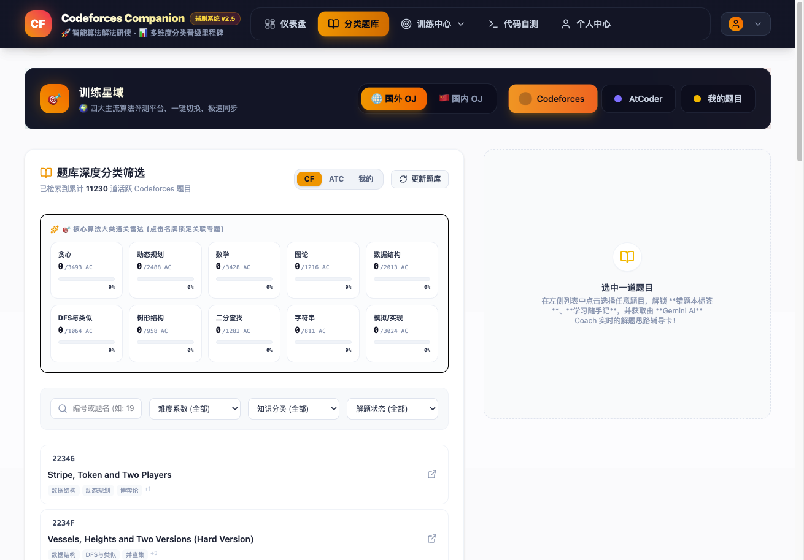
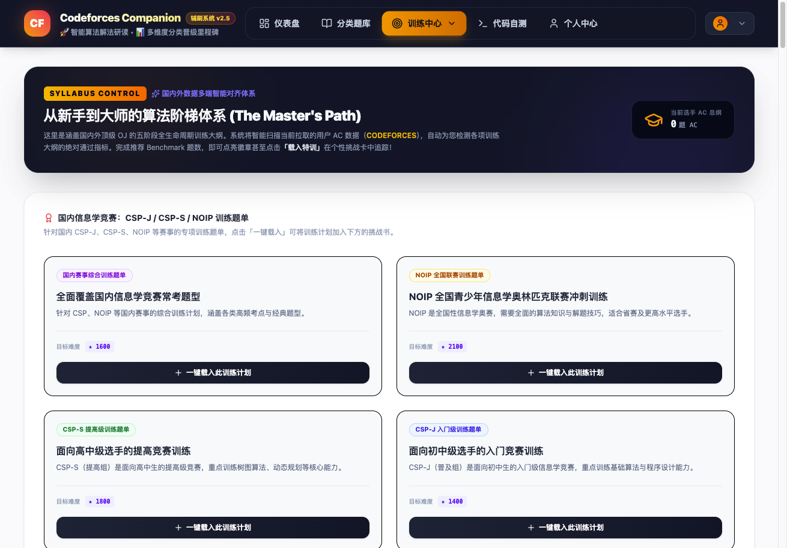
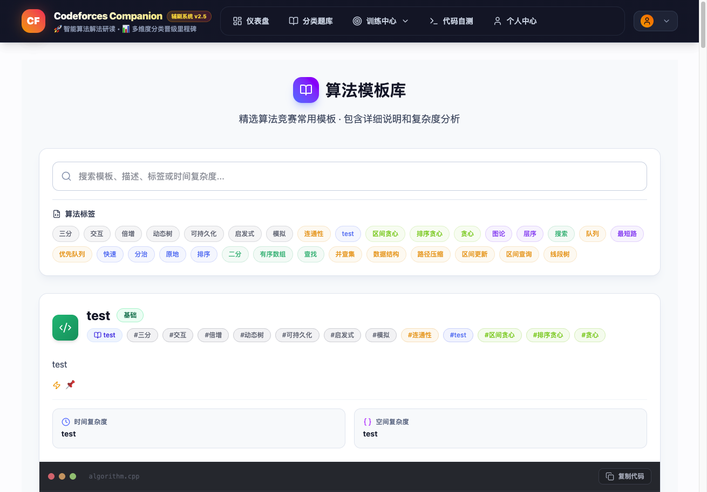
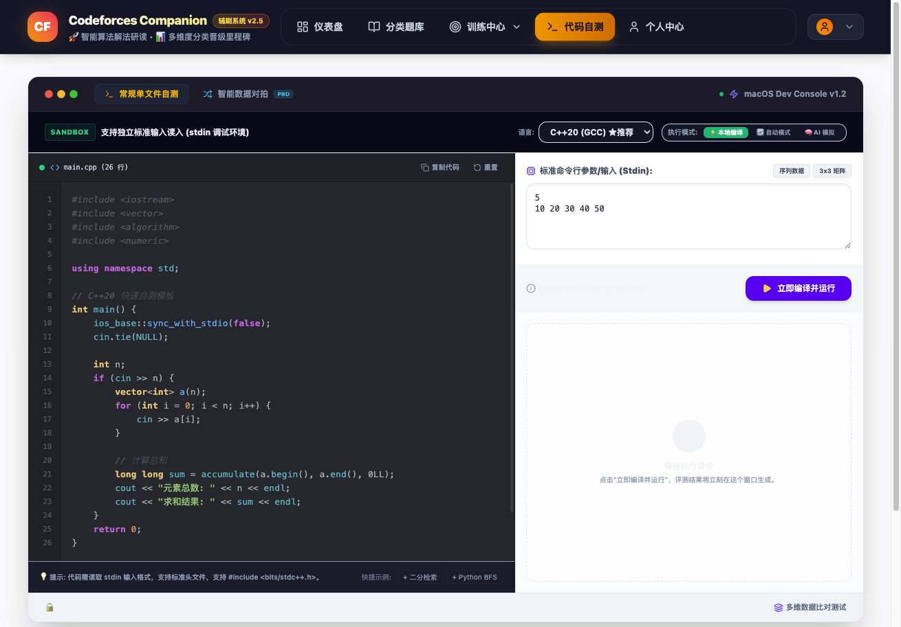
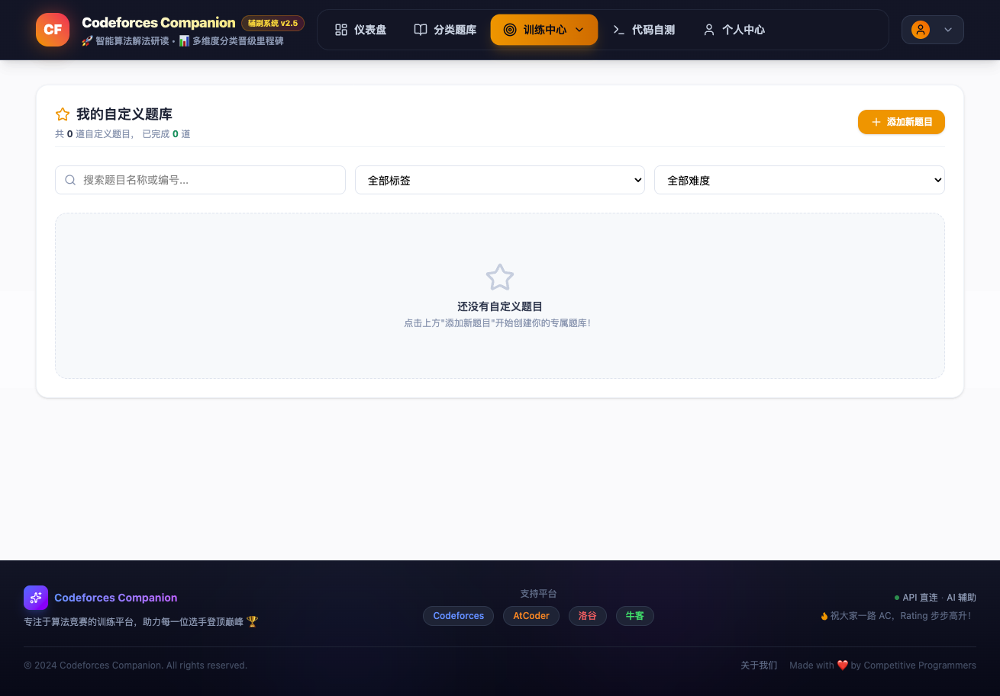

# 🚀 Codeforces Companion - 算法竞赛辅刷系统 v2.5

> 智能算法解法研读 • 多维度分类晋级里程碑 • 国内外OJ一站式训练

---

## 🌟 项目概述

**Codeforces Companion** 是一个专为算法竞赛爱好者打造的全方位训练平台，汇聚了强大的数据分析、AI辅助解题、错题本管理等功能，支持 **Codeforces、AtCoder、洛谷、牛客** 四大主流算法评测平台。

无论你是刚入门的新手，还是追求更高Rating的进阶选手，Codeforces Companion 都能为你提供个性化的训练方案和数据支持。



---

## 📱 核心功能详解

### 📊 1. 用户数据仪表盘

一键查询你的竞赛数据，全方位了解自己的成长轨迹！

**功能特点：**
- 🔍 **多平台支持**：支持 Codeforces、AtCoder、洛谷、牛客 四大平台数据同步
- 📈 **Rating 历史曲线**：直观展示你的 Rating 变化趋势，支持悬浮查看每场比赛详情
- 🏆 **段位徽章**：实时显示当前段位、历史最高分、贡献值等关键数据
- 📅 **入驻时间记录**：记录你的竞赛之旅起点

**使用场景：**
> 输入你的 Codeforces 用户名，即可看到你的完整数据画像，包括参加过的比赛、Rating 起伏、最高排名等信息。



---

### 📚 2. 分类题库深度筛选

百万题库，精准定位，高效刷题！

**功能特点：**
- 🔄 **平台一键切换**：国外 OJ（Codeforces/AtCoder）与国内 OJ（洛谷/牛客）无缝切换
- 🎯 **多维度筛选**：按难度（★800-3000）、算法标签、解题状态（AC/WA/未挑战）精准筛选
- 📊 **核心算法大类雷达**：可视化展示各算法领域的通关进度
- 🔖 **题目状态标识**：清晰标识已通过、尝试中、尚未挑战的题目

**使用场景：**
> 想专项练习动态规划？只需选择 "dp" 标签，即可筛选出所有相关题目，配合难度筛选，精准定位适合你的训练题。



---

### 🤖 3. AI 智能解题导师

卡壳了？让 AI 导师给你思路点拨！

**功能特点：**
- 💡 **思路提示**：不直接剧透代码，而是揭示黄金观察切入点
- 📝 **多语言支持**：支持 C++、Python、Java 三种主流语言的代码框架演示
- 📐 **LaTeX 公式渲染**：完美支持数学公式展示
- 📚 **解题路径分析**：详细的解题步骤和思路分析

**使用场景：**
> 遇到难题没有思路？点击「一键开启思路提示」，AI 导师将为你分析题目的关键点、给出解题方向和代码框架。

---

### 📝 4. 错题本管理

记录错题，温故知新，避免重复踩坑！

**功能特点：**
- 📁 **状态分类**：待做（Todo）、尝试中（Attempting）、已击破（Solved）
- 📝 **个人笔记**：为每道错题记录卡点、反思、关键转换方程式
- 💾 **本地存储**：数据自动保存，随时随地查看
- 🔄 **同步状态**：与平台解题状态实时同步

**使用场景：**
> 遇到做错的题目，点击「加入我的错题本」，记录你的思考过程和错误原因，方便日后复习巩固。

---

### 🎯 5. 排位挑战书

从新手到大师，五阶段系统训练！

**功能特点：**
- 📚 **五阶段大纲**：
  - **Stage 1: 筑基起步**（语法基础与工程模拟）
  - **Stage 2: 渐入佳境**（高频竞赛思维与策略构造）
  - **Stage 3: 登堂入室**（经典算法、深度状态空间与树图基础）
  - **Stage 4: 破壁跃迁**（高维树图结构、复杂优化与区间动态规划）
  - **Stage 5: 登峰造极**（极限匹配流、分治莫队与后缀精妙结构）
- 🏆 **国内赛事专项**：CSP-J、CSP-S、NOIP 训练题单
- 📊 **实时进度追踪**：自动检测各项训练大纲的完成度
- ✅ **通关徽章**：完成推荐题数即可点亮徽章

**使用场景：**
> 选择适合你的训练阶段，系统会自动推荐对应难度和标签的题目，帮助你循序渐进地提升。



---

### 📈 6. 数据统计分析

全方位了解你的算法功底！

**功能特点：**
- 🗓️ **刷题热力图**：记录近一年的刷题活跃度
- 📊 **提交状态分布**：AC、WA、TLE、MLE、CE、RE 详细统计
- 📈 **难度阶梯分布**：各难度段的 AC 数量统计
- 🎯 **八维雷达图**：基础模拟、贪心构造、动态规划、数据结构、图论算法、数学数论、高效搜索、高阶算法
- 📚 **知识偏好深度榜**：按算法标签统计 AC 数量

**使用场景：**
> 通过八维雷达图，你可以清晰看到自己的优势和短板，从而有针对性地进行训练。

---

### 🧩 7. 算法模板库

精选常用算法代码模板，随取随用！

**功能特点：**
- 📁 **分类整理**：按算法类别组织模板
- 📊 **难度标识**：基础、进阶、高级三个难度等级
- 📝 **详细说明**：包含时间复杂度、空间复杂度、使用方法
- 🔍 **代码示例**：完整的代码实现和示例输入输出

**使用场景：**
> 比赛前快速复习常用算法模板，或者在刷题时参考标准实现。



---

### 💻 8. 代码自测沙箱

在线编写和测试代码！

**功能特点：**
- ✍️ **代码编辑器**：支持多种编程语言的代码编辑
- ▶️ **在线运行**：无需离开页面即可测试代码
- 📝 **输入输出**：自定义测试用例，验证代码正确性

**使用场景：**
> 编写代码后，在沙箱中快速测试，确保逻辑正确后再提交到 OJ。



---

### 📁 9. 自定义题目管理

创建和管理属于你自己的题目！

**功能特点：**
- ✏️ **题目创建**：自定义题目描述、难度、标签
- 📋 **输入输出示例**：添加示例输入输出
- ⏱️ **时间空间限制**：设置时间和内存限制
- 📁 **分类管理**：按平台和难度分类

**使用场景：**
> 将平时遇到的好题、面试题整理成自己的题库，方便反复练习。



---

## 🌐 支持平台

| 平台 | 类型 | 特点 |
|------|------|------|
| **Codeforces** | 国外 OJ | 全球最大的算法竞赛平台，题目质量高 |
| **AtCoder** | 国外 OJ | 日本顶尖竞赛平台，题目新颖 |
| **洛谷** | 国内 OJ | 国内最受欢迎的信息学竞赛平台 |
| **牛客** | 国内 OJ | 综合编程竞赛平台，涵盖校招笔试 |

---

## 🎨 界面预览

### 主界面设计

采用现代化的深色主题设计，界面清爽，操作便捷：

- 🎯 **导航栏**：清晰的功能入口，一键切换各模块
- 📱 **响应式布局**：完美适配桌面端和移动端
- ✨ **动画效果**：流畅的过渡动画，提升使用体验
- 🌈 **配色方案**：精心设计的渐变色和配色，视觉效果出色

---

## 🚀 快速开始

### 在线体验

访问官方网站即可立即使用，无需注册也可体验大部分功能！

### 本地部署

```bash
# 1. 克隆项目
git clone https://github.com/your-repo/codeforces-companion.git

# 2. 安装依赖
npm install

# 3. 配置环境变量
# 设置 GEMINI_API_KEY（用于 AI 功能）

# 4. 启动开发服务器
npm run dev
```

---

## 🌟 项目亮点

1. **AI 辅助解题**：基于 Google Gemini 大模型，提供智能解题思路
2. **多平台支持**：一站式整合四大主流 OJ，无需切换多个网站
3. **个性化训练**：根据用户数据智能推荐训练计划和题目
4. **数据可视化**：丰富的图表和统计，直观展示训练成果
5. **离线存储**：错题本等数据本地存储，随时访问
6. **国内适配**：专门针对国内竞赛（CSP/NOIP）优化

---

## 💪 适用人群

- 🎓 **在校学生**：准备信息学竞赛（CSP、NOIP、ICPC）
- 👨‍💻 **程序员**：提升算法能力，备战技术面试
- 🏆 **竞赛选手**：系统化训练，冲击更高 Rating
- 📚 **编程爱好者**：学习算法知识，提升编程水平

---

## 📧 联系方式

如果您有任何问题、建议或合作意向，欢迎联系我们！

- 📮 邮箱：support@codeforces-companion.com
- 🌐 官网：https://codeforces-companion.com
- 🐙 GitHub：https://github.com/your-repo/codeforces-companion

---

## 🎉 结语

> "算法之路漫漫，Companion 与你同行！"

Codeforces Companion 致力于成为每一位算法竞赛爱好者的最佳训练伙伴，助力你在算法竞赛的道路上不断前进，实现自己的目标！

---

*祝大家一路 AC，Rating 步步高升！🏆*

---

**Codeforces Companion v2.5** | 专注于算法竞赛的训练平台

---

## 📱 微信公众号排版建议

为了在微信公众号中获得更好的阅读体验，建议：

1. **标题格式**：使用微信编辑器的标题样式，突出重点
2. **图片插入**：在每个功能模块插入对应的截图或示意图
3. **分割线**：使用精美分割线分隔不同功能模块
4. **配色方案**：使用品牌色（琥珀色 #f59e0b）作为点缀色
5. **排版布局**：保持段落简短，避免过长的文字段落
6. **互动元素**：添加投票、留言等互动模块，增加用户参与感

---

*本文档为 Codeforces Companion 项目介绍书，可直接复制到微信公众号编辑器中使用。*
